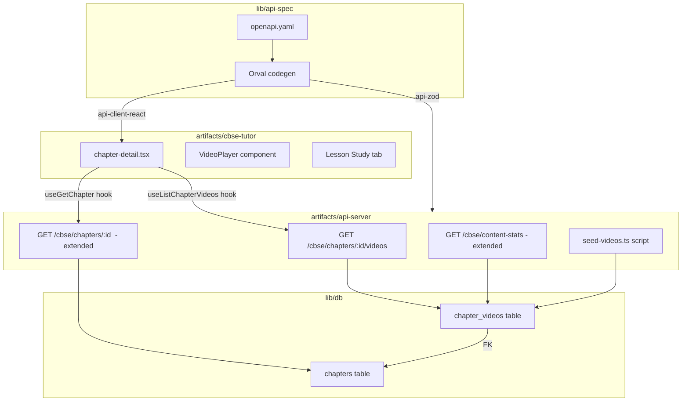

# Design Document: Videos and Lessons for CBSE 9-12 Study Guide

## Overview

This feature adds two complementary learning modalities to the CBSE 9-12 Study Guide:

1. **YouTube Video Embeds** — a new "Videos" tab on each chapter detail page that renders embedded YouTube players for curated NCERT/educational videos stored in a new `chapter_videos` DB table.
2. **Lesson Study Enhancement** — the existing "Lesson Study" tab is made robust by ensuring the API always returns `null` (not an empty string) when no lesson content exists, and by adding a proper placeholder state in the UI.

The implementation follows the existing monorepo patterns: Drizzle ORM schema → DB migration → OpenAPI spec update → Orval codegen → Express route → React component.

---

## Architecture



**Data flow for the Videos tab:**
1. `chapter-detail.tsx` mounts → calls `useGetChapter(chapterId)` (existing) and `useListChapterVideos(chapterId)` (new generated hook).
2. API server queries `chapter_videos` ordered by `display_order` and returns the array.
3. The Videos tab renders one `VideoPlayer` component per result.

**Codegen flow:**
- OpenAPI spec is the single source of truth.
- After spec changes: `pnpm --filter @workspace/api-spec run codegen` regenerates `@workspace/api-client-react` hooks and `@workspace/api-zod` Zod validators.
- The API server imports Zod validators from `@workspace/api-zod` for request/response parsing.

---

## Components and Interfaces

### New DB Schema: `chapter_videos`

File: `lib/db/src/schema/chapter_videos.ts`

```typescript
import { pgTable, text, serial, integer } from "drizzle-orm/pg-core";
import { createInsertSchema } from "drizzle-zod";
import { z } from "zod/v4";
import { chaptersTable } from "./chapters";

export const chapterVideosTable = pgTable("chapter_videos", {
  id: serial("id").primaryKey(),
  chapterId: integer("chapter_id").notNull().references(() => chaptersTable.id),
  youtubeVideoId: text("youtube_video_id").notNull(),
  title: text("title").notNull(),
  description: text("description"),
  displayOrder: integer("display_order").notNull().default(0),
});

export const insertChapterVideoSchema = createInsertSchema(chapterVideosTable).omit({ id: true });
export type InsertChapterVideo = z.infer<typeof insertChapterVideoSchema>;
export type ChapterVideo = typeof chapterVideosTable.$inferSelect;
```

### OpenAPI Spec Changes

**New schema: `ChapterVideo`**
```yaml
ChapterVideo:
  type: object
  properties:
    id:          { type: integer }
    chapterId:   { type: integer }
    youtubeVideoId: { type: string }
    title:       { type: string }
    description: { type: ["string", "null"] }
    displayOrder: { type: integer }
  required: [id, chapterId, youtubeVideoId, title, displayOrder]
```

**Updated schema: `ChapterDetail`** — add `videos` field:
```yaml
videos:
  type: array
  items:
    $ref: "#/components/schemas/ChapterVideo"
```

**New endpoint: `GET /cbse/chapters/{chapterId}/videos`**
- operationId: `listChapterVideos`
- Returns `array` of `ChapterVideo`, ordered by `displayOrder`
- 400 on invalid `chapterId`

**Updated schema: `ContentStats`** — add two fields:
```yaml
chaptersWithVideos: { type: integer }
totalVideos:        { type: integer }
```

### API Route Handler

File: `artifacts/api-server/src/routes/cbse.ts` — additions:

- `GET /cbse/chapters/:chapterId/videos` — validates `chapterId` with Zod, queries `chapterVideosTable` with `eq` + `orderBy(chapterVideosTable.displayOrder)`, returns array (empty array if none).
- `GET /cbse/chapters/:chapterId` — extended to also query `chapterVideosTable` and include `videos` in the `GetChapterResponse`.
- `GET /cbse/content-stats` — extended with two additional DB queries: `count(distinct chapterId)` and `count(*)` from `chapterVideosTable`.

YouTube video ID validation is applied in the route handler using a Zod refinement: `.regex(/^[A-Za-z0-9_-]{11}$/)`.

### Frontend: `VideoPlayer` Component

File: `artifacts/cbse-tutor/src/components/video-player.tsx`

```typescript
interface VideoPlayerProps {
  youtubeVideoId: string;
  title: string;
  description?: string | null;
}
```

Renders:
1. `<h3>` with `title` above the iframe
2. `<iframe>` with `src="https://www.youtube.com/embed/{youtubeVideoId}"`, `allow="accelerometer; autoplay; clipboard-write; encrypted-media; gyroscope; picture-in-picture"`, `allowFullScreen`
3. `<p>` with `description` below the iframe (only when non-null)

### Frontend: `chapter-detail.tsx` Changes

- Tab grid changes from `grid-cols-3` to `grid-cols-4`.
- New `TabsTrigger value="videos"` added after "Overview".
- New `TabsContent value="videos"` renders:
  - If `videosLoading`: loading spinner
  - If `videos.length > 0`: maps over `videos` sorted by `displayOrder`, renders `<VideoPlayer>` per item
  - If `videos.length === 0`: placeholder card ("Videos coming soon for this chapter")
- Uses `useListChapterVideos(chapterId)` hook (generated by Orval).

### Seed Script

File: `artifacts/api-server/src/scripts/seed-videos.ts`

- Reads a JSON file path from `process.argv[2]`
- Parses array of `{ chapterId, youtubeVideoId, title, description?, displayOrder? }`
- Validates each `youtubeVideoId` against `/^[A-Za-z0-9_-]{11}$/`
- Bulk inserts using Drizzle `onConflictDoNothing()` targeting `(chapter_id, youtube_video_id)`
- Prints `Inserted: N, Skipped: M` to stdout

---

## Data Models

### `chapter_videos` table

| Column           | Type    | Constraints                              |
|------------------|---------|------------------------------------------|
| `id`             | serial  | PRIMARY KEY                              |
| `chapter_id`     | integer | NOT NULL, FK → `chapters.id`             |
| `youtube_video_id` | text  | NOT NULL                                 |
| `title`          | text    | NOT NULL                                 |
| `description`    | text    | nullable                                 |
| `display_order`  | integer | NOT NULL, DEFAULT 0                      |

Unique constraint on `(chapter_id, youtube_video_id)` — enables `ON CONFLICT DO NOTHING` in the seed script.

### `ChapterVideo` API shape (camelCase)

```typescript
{
  id: number;
  chapterId: number;
  youtubeVideoId: string;   // validated: /^[A-Za-z0-9_-]{11}$/
  title: string;
  description: string | null;
  displayOrder: number;
}
```

### `ChapterDetail` API shape — extended

Adds `videos: ChapterVideo[]` to the existing shape. The field is always present (empty array when no videos exist).

### `ContentStats` API shape — extended

Adds:
```typescript
chaptersWithVideos: number;  // count of distinct chapter_ids in chapter_videos
totalVideos: number;         // total rows in chapter_videos
```

---

## Correctness Properties

*A property is a characteristic or behavior that should hold true across all valid executions of a system — essentially, a formal statement about what the system should do. Properties serve as the bridge between human-readable specifications and machine-verifiable correctness guarantees.*

### Property 1: Multiple videos per chapter

*For any* chapter ID, inserting N distinct videos for that chapter should result in exactly N rows retrievable for that chapter.

**Validates: Requirements 1.3**

---

### Property 2: Videos returned in display_order ascending

*For any* set of videos with arbitrary `displayOrder` values inserted for a chapter, querying them via the API should return them sorted strictly ascending by `displayOrder`.

**Validates: Requirements 1.4, 2.2**

---

### Property 3: Invalid chapterId returns HTTP 400

*For any* value of `chapterId` that is not a positive integer (zero, negative, non-numeric string), the `GET /cbse/chapters/{chapterId}/videos` endpoint should return HTTP 400 with an `ApiError` response body.

**Validates: Requirements 2.4**

---

### Property 4: ChapterVideo response shape completeness

*For any* `ChapterVideo` object returned by the API, the object must contain all required fields (`id`, `chapterId`, `youtubeVideoId`, `title`, `displayOrder`) with their correct types, and `description` must be either a string or null.

**Validates: Requirements 2.5**

---

### Property 5: Lesson content round-trip

*For any* chapter with a non-null, non-empty `lesson_study` value in the DB, the `GET /cbse/chapters/{chapterId}` response must return `lessonStudy` as a non-null string equal to the stored value.

**Validates: Requirements 3.1**

---

### Property 6: Null/empty lesson_study normalised to null

*For any* chapter where `lesson_study` is null or the empty string, the API response must return `lessonStudy` as `null` (never an empty string).

**Validates: Requirements 3.2**

---

### Property 7: VideoPlayer embed URL construction

*For any* valid `youtubeVideoId` string, the `VideoPlayer` component must render an `<iframe>` whose `src` attribute is exactly `https://www.youtube.com/embed/{youtubeVideoId}` with no additional query parameters or path segments.

**Validates: Requirements 4.4, 8.3**

---

### Property 8: VideoPlayer renders title and conditional description

*For any* `ChapterVideo` object, the rendered `VideoPlayer` must display the `title` above the iframe; and if `description` is non-null, it must also display the description below the iframe.

**Validates: Requirements 4.6, 4.7**

---

### Property 9: Videos tab renders one player per video in order

*For any* non-empty list of `ChapterVideo` objects, the Videos tab must render exactly one `VideoPlayer` per video, in ascending `displayOrder` order.

**Validates: Requirements 4.2**

---

### Property 10: Content stats video counts are consistent

*For any* state of the `chapter_videos` table, `GET /cbse/content-stats` must return `chaptersWithVideos` equal to the number of distinct `chapter_id` values and `totalVideos` equal to the total row count.

**Validates: Requirements 6.2, 6.3**

---

### Property 11: YouTube video ID validation accepts valid and rejects invalid

*For any* string, the `youtubeVideoId` validator must accept exactly those strings matching `/^[A-Za-z0-9_-]{11}$/` and reject all others with an appropriate error.

**Validates: Requirements 8.1, 8.2**

---

### Property 12: Seed script idempotency

*For any* set of video records, running the seed script twice with the same input must produce the same DB state as running it once — no duplicate rows, no errors on the second run.

**Validates: Requirements 7.3**

---

### Property 13: Seed script inserts all valid records

*For any* array of valid video records in the input JSON, running the seed script must result in all records being present in the `chapter_videos` table.

**Validates: Requirements 7.2**

---

## Error Handling

| Scenario | Behaviour |
|---|---|
| `chapterId` is not a positive integer | HTTP 400 `{ error: "..." }` from Zod parse failure |
| Chapter not found (videos endpoint) | HTTP 200 with empty array (no 404 — absence of videos is valid) |
| Chapter not found (chapter detail endpoint) | HTTP 404 `{ error: "Chapter not found" }` (existing behaviour) |
| `youtubeVideoId` fails regex validation | HTTP 400 `{ error: "..." }` from Zod refinement |
| DB connection failure | Express default error handler → HTTP 500 |
| Seed script: invalid JSON file | Process exits with non-zero code and error message to stderr |
| Seed script: invalid `youtubeVideoId` in input | Record is skipped, counted as skipped, warning printed to stderr |
| Frontend: videos fetch error | Error boundary / `isError` state shows generic error message |
| Frontend: `lessonStudy` is null | Placeholder card rendered (no crash) |

---

## Testing Strategy

### Unit Tests

Focus on specific examples and edge cases:

- `VideoPlayer` renders correct iframe `src` for a known video ID
- `VideoPlayer` renders title above iframe
- `VideoPlayer` renders description when present, omits it when null
- `VideoPlayer` sets correct `allow` attribute and `allowFullScreen`
- Videos tab shows placeholder when `videos` is empty
- Lesson tab shows `MarkdownRenderer` when `lessonStudy` is non-null
- Lesson tab shows placeholder when `lessonStudy` is null
- `youtubeVideoId` validator accepts `"dQw4w9WgXcQ"` (11 chars, valid chars)
- `youtubeVideoId` validator rejects `""`, `"short"`, `"toolongstring12"`, `"invalid!@#$%^&*("`

### Property-Based Tests

Uses **fast-check** (already available in the JS ecosystem, compatible with Vitest).

Each property test runs a minimum of **100 iterations**.

Tag format: `// Feature: cbse-videos-lessons, Property N: <property_text>`

| Property | Test description | Generator |
|---|---|---|
| P1 | Multiple videos per chapter | `fc.integer({ min: 1, max: 20 })` for count, `fc.integer({ min: 1 })` for chapterId |
| P2 | Videos returned in display_order ascending | `fc.array(fc.record({ displayOrder: fc.integer() }), { minLength: 1 })` |
| P3 | Invalid chapterId → 400 | `fc.oneof(fc.constant(0), fc.integer({ max: -1 }), fc.string())` |
| P4 | ChapterVideo shape completeness | `fc.record(...)` generating valid ChapterVideo-like objects |
| P5 | Lesson content round-trip | `fc.string({ minLength: 1 })` for lesson content |
| P6 | Null/empty lessonStudy → null | `fc.oneof(fc.constant(null), fc.constant(""))` |
| P7 | VideoPlayer embed URL | `fc.stringMatching(/^[A-Za-z0-9_-]{11}$/)` for youtubeVideoId |
| P8 | VideoPlayer title + description | `fc.record({ title: fc.string({ minLength: 1 }), description: fc.option(fc.string()) })` |
| P9 | Videos tab renders one player per video | `fc.array(fc.record({ ... }), { minLength: 1 })` |
| P10 | Content stats consistency | `fc.array(fc.record({ chapterId: fc.integer({ min: 1 }) }))` |
| P11 | YouTube ID validation | `fc.string()` for invalid; `fc.stringMatching(/^[A-Za-z0-9_-]{11}$/)` for valid |
| P12 | Seed script idempotency | `fc.array(validVideoRecord)` |
| P13 | Seed script inserts all records | `fc.array(validVideoRecord, { minLength: 1 })` |

### Integration Tests

- `GET /cbse/chapters/:id/videos` returns correct data from a real (test) DB
- `GET /cbse/chapters/:id` includes `videos` array in response
- `GET /cbse/content-stats` returns updated `chaptersWithVideos` and `totalVideos` after inserts
- Seed script end-to-end: run against test DB, verify row counts

### Test File Locations

```
artifacts/cbse-tutor/src/components/__tests__/video-player.test.tsx
artifacts/cbse-tutor/src/pages/__tests__/chapter-detail-videos.test.tsx
artifacts/api-server/src/__tests__/cbse-videos.test.ts
artifacts/api-server/src/__tests__/cbse-videos.property.test.ts
artifacts/api-server/src/scripts/__tests__/seed-videos.test.ts
```
